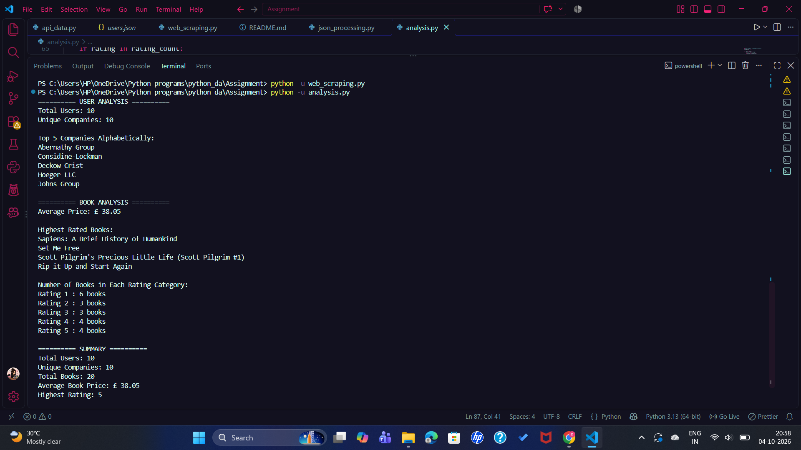

# Data Collection and Processing Using JSON, APIs and Web Scraping

## Course

Python for Data Engineering

## Project Overview

This project demonstrates a simple data collection and processing pipeline using Python.

Data is collected from two different sources:

1. JSONPlaceholder API for user data
2. Books to Scrape website for book data

The collected data is processed, cleaned, stored in JSON format, and analyzed using Python.

---

## Objectives

- Fetch data from a REST API
- Parse and process JSON data
- Perform web scraping using BeautifulSoup
- Clean and transform collected data
- Store structured data in JSON files
- Perform basic data analysis
- Generate a combined JSON report

---

## Technologies Used

- Python
- Requests
- BeautifulSoup
- JSON
- REST API
- Web Scraping

---

## Project Structure

```text
Assignment/
│
├── 01_API_Output.png.png
├── 02_Book_Scraping_Output.png.png
├── 03_Final_Analysis.png.png
│
├── analysis.py
├── api_data.py
├── books.json
├── json_processing.py
├── README.md
├── report.json
├── users.json
└── web_scraping.py
```

---

# Part A: API Data Collection

## API Used

JSONPlaceholder API:

https://jsonplaceholder.typicode.com/users

The `api_data.py` program:

- Fetches user records from the API
- Extracts user name
- Extracts email
- Extracts company name
- Counts total users
- Extracts company names
- Stores processed data in `users.json`

### Result

- Total Users: 10
- Unique Companies: 10

## API Output


---

# Part B: Web Scraping

## Website Used

Books to Scrape:

https://books.toscrape.com/

The `web_scraping.py` program extracts:

- Book Title
- Price
- Rating

A total of 20 books were collected.

Ratings were converted from text into numerical values:

```text
One   = 1
Two   = 2
Three = 3
Four  = 4
Five  = 5
```

## Book Analysis

- Most Expensive Book: Our Band Could Be Your Life
- Most Expensive Price: £57.25
- Least Expensive Book: Starving Hearts (Triangular Trade Trilogy, #1)
- Least Expensive Price: £13.99
- Average Book Price: £38.05

The processed book data is stored in:

`books.json`

## Web Scraping Output


---

# Part C: JSON Processing

The `json_processing.py` program loads:

- `users.json`
- `books.json`

It performs the following operations:

- Counts total records
- Displays books with rating greater than 4
- Finds users belonging to companies containing the word "Group"
- Generates a combined JSON report

The final report is stored in:

`report.json`

## Report Summary

```json
{
    "total_users": 10,
    "total_books": 20,
    "average_price": 38.05
}
```

---

# Part D: Data Analysis

The `analysis.py` program performs user and book analysis.

## User Analysis

- Total Users: 10
- Unique Companies: 10
- Top 5 Companies are displayed alphabetically

## Book Analysis

- Average Book Price: £38.05
- Highest Rating: 5
- Highest Rated Books are displayed

## Rating Distribution

| Rating | Number of Books |
|--------|-----------------|
| 1      | 6               |
| 2      | 3               |
| 3      | 3               |
| 4      | 4               |
| 5      | 4               |

## Final Analysis Output



---

# How to Run the Project

## 1. Install Required Libraries

Open the terminal and run:

```bash
pip install requests beautifulsoup4
```

## 2. Run API Data Collection

```bash
python api_data.py
```

This creates:

```text
users.json
```

## 3. Run Web Scraping

```bash
python web_scraping.py
```

This creates:

```text
books.json
```

## 4. Process JSON Data

```bash
python json_processing.py
```

This creates:

```text
report.json
```

## 5. Perform Data Analysis

```bash
python analysis.py
```

---

# Output Summary

| Metric | Result |
|--------|--------|
| Total Users | 10 |
| Total Books | 20 |
| Unique Companies | 10 |
| Average Book Price | £38.05 |
| Highest Rating | 5 |

## Rating Distribution

| Rating | Books |
|--------|-------|
| 1 | 6 |
| 2 | 3 |
| 3 | 3 |
| 4 | 4 |
| 5 | 4 |

---

# Learning Outcomes

Through this project, I learned how to:

- Consume REST APIs using Python
- Work with JSON data
- Perform web scraping using BeautifulSoup
- Clean and transform data
- Store structured data
- Perform basic data analysis
- Build a simple ETL pipeline

---

# Conclusion

This project demonstrates a basic data engineering workflow in which data is collected from multiple sources, processed using Python, stored in JSON format, and analyzed to generate useful insights.