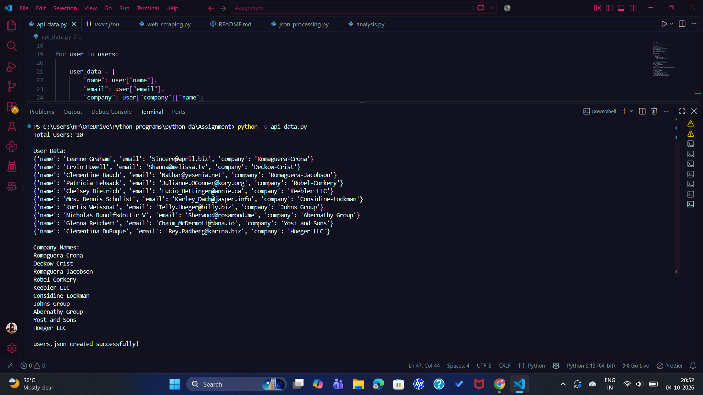
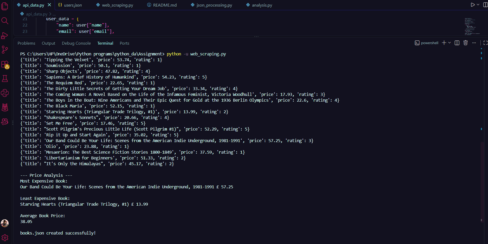

# Data Collection and Processing Using APIs, Web Scraping and JSON

## Course

Python for Data Engineering

## Project Overview

This project demonstrates a basic data engineering workflow using Python.

Data is collected from two external sources:

1. **JSONPlaceholder REST API** for user data
2. **Books to Scrape** website for book data

The collected data is fetched, cleaned, transformed, validated, stored in JSON format, processed, and analyzed.

The project also demonstrates basic software engineering practices including:

- Modular Python functions
- Exception handling
- HTTP request timeouts
- Data validation
- JSON processing
- Dependency management
- Structured documentation

---

## Objectives

The main objectives of this project are to:

- Fetch data from a REST API
- Parse and process JSON data
- Perform web scraping using BeautifulSoup
- Clean and transform collected data
- Validate collected data
- Store structured data in JSON files
- Perform data analysis using Python
- Generate a combined JSON report
- Handle common API, file, and data-processing errors

---

## Technologies Used

| Technology | Purpose |
|---|---|
| Python 3 | Data collection, processing and analysis |
| Requests | API calls and web requests |
| BeautifulSoup4 | HTML parsing and web scraping |
| JSON | Data storage and processing |
| REST API | External user data source |
| Git | Version control |
| GitHub | Project hosting |

---

## Project Structure

```text
Assignment-01-Data-Collection/
│
├── 01_API_Output.png
├── 02_Book_Scraping_Output.png
├── 03_Final_Analysis.png
│
├── api_data.py
├── web_scraping.py
├── json_processing.py
├── analysis.py
│
├── users.json
├── books.json
├── report.json
├── requirements.txt
└── README.md
```

### File Description

| File | Description |
|---|---|
| `api_data.py` | Fetches and processes user data from JSONPlaceholder API |
| `web_scraping.py` | Scrapes book title, price and rating data |
| `json_processing.py` | Processes the generated JSON files and creates a combined report |
| `analysis.py` | Performs user and book data analysis |
| `users.json` | Processed API user data |
| `books.json` | Scraped and cleaned book data |
| `report.json` | Combined processing report |
| `requirements.txt` | Python dependencies |
| `README.md` | Project documentation |
| `*.png` | Screenshots of program outputs |

---

# Part A: API Data Collection

## API Used

**JSONPlaceholder REST API**

https://jsonplaceholder.typicode.com/users

The `api_data.py` program performs the following operations:

- Sends a GET request to the REST API
- Uses a request timeout
- Checks the HTTP response status
- Handles request-related exceptions
- Parses the API response as JSON
- Extracts:
  - Name
  - Username
  - Email
  - Company name
- Counts total users
- Extracts company names
- Stores processed records in `users.json`

### API Result

- **Total Users:** 10
- **Unique Companies:** 10

### Sample Processed Record

```json
{
    "name": "Leanne Graham",
    "username": "Bret",
    "email": "Sincere@april.biz",
    "company": "Romaguera-Crona"
}
```

## API Output



---

# Part B: Web Scraping

## Website Used

**Books to Scrape**

https://books.toscrape.com/

The `web_scraping.py` program uses `Requests` and `BeautifulSoup4` to extract:

- Book title
- Book price
- Book rating

A total of **20 books** were collected.

## Rating Transformation

The website represents ratings using text values. These are converted into numerical values:

```text
One   = 1
Two   = 2
Three = 3
Four  = 4
Five  = 5
```

## Data Cleaning and Validation

The scraper performs basic data cleaning and validation:

- Removes currency symbols from prices
- Converts prices from text to floating-point numbers
- Converts ratings from text to integers
- Checks for missing HTML elements
- Validates price conversion
- Validates rating values
- Ensures that at least 20 books are collected
- Uses HTTP error handling and request timeout

## Book Analysis

The collected data produced the following results:

- **Most Expensive Book:** Our Band Could Be Your Life: Scenes from the American Indie Underground, 1981-1991
- **Most Expensive Price:** £57.25
- **Least Expensive Book:** Starving Hearts (Triangular Trade Trilogy, #1)
- **Least Expensive Price:** £13.99
- **Average Book Price:** £38.05

The processed book data is stored in:

```text
books.json
```

## Web Scraping Output



---

# Part C: JSON Processing

The `json_processing.py` program processes the JSON files generated by the previous stages.

### Input Files

```text
users.json
books.json
```

### Operations Performed

- Loads JSON files
- Handles missing files
- Handles invalid JSON
- Validates that the loaded data has the expected list structure
- Counts total users and books
- Finds books with rating greater than 4
- Finds users whose company name contains `"Group"`
- Calculates average book price
- Generates a combined JSON report

### Processing Results

**Books with rating greater than 4:**

1. Sapiens: A Brief History of Humankind
2. Set Me Free
3. Scott Pilgrim's Precious Little Life (Scott Pilgrim #1)
4. Rip it Up and Start Again

**Users belonging to companies containing `"Group"`:**

1. Kurtis Weissnat — Johns Group
2. Nicholas Runolfsdottir V — Abernathy Group

## Report Structure

The generated `report.json` contains two main sections:

```json
{
    "user_summary": {
        "total_users": 10,
        "group_company_users": [
            {
                "name": "Kurtis Weissnat",
                "company": "Johns Group"
            }
        ]
    },
    "book_summary": {
        "total_books": 20,
        "average_price": 38.05,
        "high_rated_books": [
            {
                "title": "Sapiens: A Brief History of Humankind",
                "rating": 5
            }
        ]
    }
}
```

The actual `report.json` contains all matching users and high-rated books generated from the processed datasets.

---

# Part D: Data Analysis

The `analysis.py` program performs analysis using reusable Python functions.

## User Analysis

- **Total Users:** 10
- **Unique Companies:** 10
- **Top 5 Companies:** displayed alphabetically

### Top 5 Companies Alphabetically

1. Abernathy Group
2. Considine-Lockman
3. Deckow-Crist
4. Hoeger LLC
5. Johns Group

## Book Analysis

- **Total Books:** 20
- **Average Book Price:** £38.05
- **Highest Rating:** 5

### Highest Rated Books

The following books have the highest rating of 5:

1. Sapiens: A Brief History of Humankind
2. Set Me Free
3. Scott Pilgrim's Precious Little Life (Scott Pilgrim #1)
4. Rip it Up and Start Again

## Rating Distribution

| Rating | Number of Books |
|---:|---:|
| 1 | 6 |
| 2 | 3 |
| 3 | 3 |
| 4 | 4 |
| 5 | 4 |

The rating distribution is calculated dynamically from the scraped dataset.

## Final Analysis Output


---

# Error Handling and Validation

Basic error handling and validation have been implemented throughout the project.

## API and Web Scraping

- Request timeout
- HTTP status validation using `raise_for_status()`
- Network exception handling
- Handling of unavailable API/web responses

## Web Scraping Validation

- Missing HTML element checks
- Price conversion validation
- Rating validation
- Minimum 20-book validation

## JSON Processing

- Missing file handling
- Invalid JSON handling
- JSON structure validation
- Empty dataset handling

---

# Code Organization

The Python programs use functions to separate responsibilities.

For example:

```text
api_data.py
│
├── fetch_users()
├── process_users()
├── save_users()
└── main()
```

```text
web_scraping.py
│
├── fetch_webpage()
├── scrape_books()
├── analyze_prices()
├── save_books()
└── main()
```

```text
json_processing.py
│
├── load_json()
├── find_high_rated_books()
├── find_group_users()
├── calculate_average_price()
├── create_report()
├── save_report()
└── main()
```

```text
analysis.py
│
├── load_json()
├── analyze_users()
├── analyze_books()
├── display_analysis()
└── main()
```

This separation makes the code easier to read, maintain, test, and extend.

---

# Installation

## 1. Clone or Download the Repository

The project can be downloaded from GitHub or cloned using Git.

## 2. Install Dependencies

Open a terminal inside the assignment directory and run:

```bash
pip install -r requirements.txt
```

The project requires:

```text
requests
beautifulsoup4
```

---

# How to Run

Run the scripts in the following order.

## Step 1 — API Data Collection

```bash
python api_data.py
```

Output:

```text
users.json
```

## Step 2 — Web Scraping

```bash
python web_scraping.py
```

Output:

```text
books.json
```

## Step 3 — JSON Processing

```bash
python json_processing.py
```

Output:

```text
report.json
```

## Step 4 — Data Analysis

```bash
python analysis.py
```

The analysis results are displayed in the terminal.

---

# Output Summary

| Metric | Result |
|---|---:|
| Total Users | 10 |
| Total Books | 20 |
| Unique Companies | 10 |
| Average Book Price | £38.05 |
| Highest Rating | 5 |

## Rating Distribution

| Rating | Books |
|---:|---:|
| 1 | 6 |
| 2 | 3 |
| 3 | 3 |
| 4 | 4 |
| 5 | 4 |

---

# Learning Outcomes

Through this project, I learned how to:

- Consume REST APIs using Python
- Work with JSON data
- Parse HTML using BeautifulSoup
- Perform web scraping
- Clean and transform collected data
- Validate data
- Handle API and file-related errors
- Store structured data in JSON
- Perform data analysis using Python
- Write modular Python programs
- Manage project dependencies
- Use Git and GitHub for version control
- Document a data processing project

---

# Conclusion

This project demonstrates a basic data engineering workflow in which data is collected from multiple sources, cleaned and transformed using Python, stored in structured JSON files, processed, and analyzed to generate useful insights.

The project also demonstrates fundamental software engineering practices including modular functions, exception handling, validation, dependency management, structured data storage, version control, and project documentation.